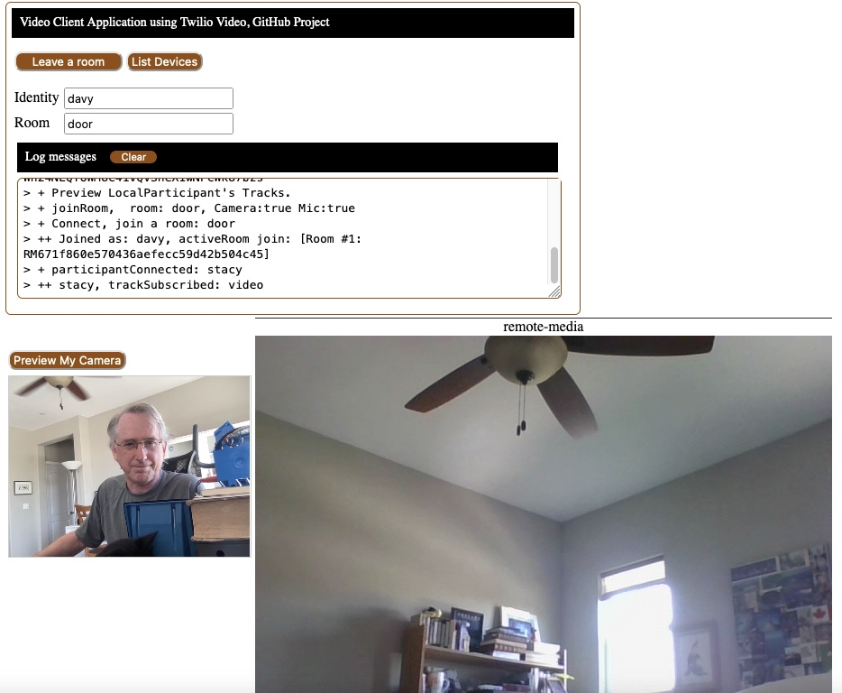

#### Application Files

+ [webserver.js](webserver.js) : a NodeJS Express HTTP Server that serves the client files 
and generates Twilio video tokens.
+ [docroot/index.html](docroot/index.html) : Client HTML, basic video client application
+ [docroot/video.js](docroot/video.js) : JavaScript code.
+ [docroot/video.css](docroot/video.css) : Web page styles and formatting
+ app.json and package.json, file descriptures for deploying to Heroku.
+ [docroot/index.php](docroot/index.php) : Sample PHP generation of a token that would be used.

For testing, check and close rooms:
+ [lpListAllRoomsParticipants.js](lpListAllRoomsParticipants.js) : program to list all rooms and their participants.
+ [lrListAllVideoRooms.js](crCompleteAllRooms.js) : program to list all active rooms.
+ [crCompleteAllRooms.js](crCompleteAllRooms.js) : program to close all rooms (room status set to "completed").

JavaScript based on:
+ [documentation samples](https://www.twilio.com/docs/video/javascript-getting-started).

# Twilio JavaScript Video client web application 

In development, works:
+ User sets their identity.
+ They can preview their local video track to test their camera.
+ They can enter a room name and join the room.
+ A second participant can join the room. When they do, each participant can view the other's video track.
I believe audio is working, but have not tested it.
+ Participants can leave a room. When they leave the tracks are stopped, and no longer displayed locally and remotely.

To do:
+ Handle more that 2 participants in a room.
+ Mute and unmute audio during a session.
+ Turn video track off and on during a session.

[](https://heroku.com/deploy?template=https://github.com/tigerfarm/tfpvideo)

### Web Client Screen Print



--------------------------------------------------------------------------------
### Web Client Functionality

This documents: [docroot/video.js](docroot/video.js), JavaScript code.

#### Startup
window.onload : initialize log message text box. Bind functionality to HTML buttons in [index.html](docroot/index.html)

#### Preview Video Track
[previewLocalTracks()](https://www.twilio.com/docs/video/javascript-getting-started#display-a-camera-preview)
: append the Twilio Video video track into a DIV container.
````
Before attaching video track:
    <div id="local-media"></div>
After attaching video track:
    <div id="local-media"><video autoplay=""></video></div>
````

#### Join a Room
[joinRoom()](https://www.twilio.com/docs/video/javascript-getting-started#connect-to-a-room)
: connect to a room using a Twilio Video token and connection options.
+ Preview local video track.
+ Attach the Tracks of the Room's current Participants: attachParticipantTracks(participant)
+ Set room event handling: participantConnected, participantDisconnected, and disconnected(you disconnect).

[attachParticipantTracks(participant)](https://www.twilio.com/docs/video/javascript-getting-started#display-a-remote-participants-video)
: append the remote participant's Twilio Video video track into a DIV container.
````
Before attaching participant video track:
    <div id="remote-media-div">remote-media</div>
After attaching video track:
    <div id="remote-media-div">remote-media<div id="stacy"><video autoplay=""></video></div></div>
````

--------------------------------------------------------------------------------
### Documentation Links

[Programmable Video Getting Started: JavaScript](https://www.twilio.com/docs/video/javascript-getting-started)
steps to create a video client web application.

Generate tokens documentation with a sample
[Node.JS program](https://www.twilio.com/docs/iam/access-tokens?code-sample=code-create-an-access-token-for-video&code-language=Node.js&code-sdk-version=3.x)

[Programmable Video Tutorials](https://www.twilio.com/docs/video/tutorials)

[Part 1: Creating a server with Node/Express](https://www.twilio.com/docs/video/tutorials/get-started-with-twilio-video-node-express-server)

[Part 2: Creating the Frontend](https://www.twilio.com/docs/video/tutorials/get-started-with-twilio-video-node-express-frontend)
````
const handleDisconnectedParticipant = (participant) => {
  // stop listening for this participant
  participant.removeAllListeners();
  // remove this participant's div from the page
  const participantDiv = document.getElementById(participant.identity);
  participantDiv.remove();
};
````

--------------------------------------------------------------------------------

Cheers...
