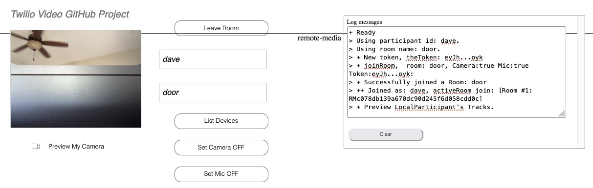

# Twilio JavaScript Video client web application 

In development.

### Web Client

--------------------------------------------------------------------------------
### Documentation Links

[Programmable Video Getting Started: JavaScript](https://www.twilio.com/docs/video/javascript-getting-started)
steps to create a video client web application.

Generate tokens documentation with a sample
[Node.JS program](https://www.twilio.com/docs/iam/access-tokens?code-sample=code-create-an-access-token-for-video&code-language=Node.js&code-sdk-version=3.x)

--------------------------------------------------------------------------------

Cheers...
